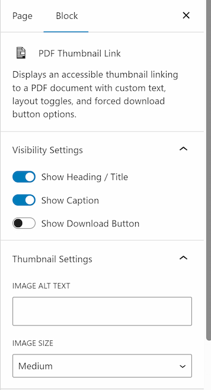
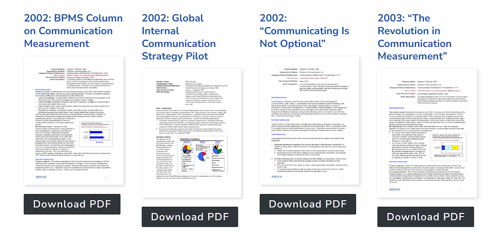
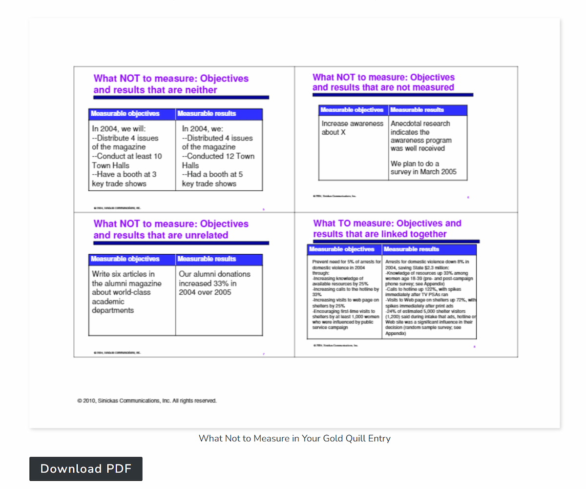

# PDF Thumbnail Link Block 

Contributors: wpfangirl  
Tags: pdf, thumbnail, media, block, accessibility, gutenberg  
Requires at least: 6.5  
Tested up to: 7.0  
Requires PHP: 7.4  
Stable tag: 1.4.3  
License: GPL-2.0+  
License URI: https://www.gnu.org/licenses/gpl-2.0.html  

An accessible native WordPress block to display a thumbnail linking to a PDF document with full layout controls, a grid-friendly accessible interface, and forced download options.

## History

The **PDF Thumbnail Link Block** started as an ACF block in 2019 or 2020. It was originally built for a client that published many PDF files, in part because the PDF flipbooks and embeds of the time were neither responsive nor performant. It could include either the automatic first-page thumbnail generated by WordPress on sites that support Imagick via `wp_get_attachment_image()` or PDF thumbnails generated by plugins like PDF Thumbnails Premium via `get_the_post_thumbnail()`. The thumbnail image linked directly to the PDF file.

I tried to persuade the core editor team to include the thumbnail as an option for the core file block, but in the end they only included the embed option. I continued to use (and elaborate on) the ACF block. In 2026, I finally decided to convert it into a native block (with help from AI because I still haven't learned JavaScript deeply).

## Description

The **PDF Thumbnail Link Block** is perfect for resource libraries, newsletters, board documents, and file grids. , lets you toggle headings and captions, and can generate a direct download button.

### Key Features
* **Grid Accessibility Built-In:** Dynamically injects unique screen-reader `aria-label` attributes behind the scenes, ensuring screen-reader users don't get trapped in a sea of identical "Download PDF" links.
* **Layout Toggles:** Turn titles, captions, and download buttons on or off on a block-by-block basis right from the editor sidebar.
* **Theme Integration:** Automatically inherits your active theme's native button colors, text styling, and hover rules.

## Installation 

1. Upload the entire `pdf-thumbnail-link` folder to your site's `/wp-content/plugins/` directory, or upload the zipped plugin file via **Plugins > Add New > Upload Plugin**.
2. Activate the plugin through the **Plugins** screen in WordPress.
3. Open any Page or Post editor, click the **+** block inserter, search for "PDF Thumbnail Link", and add it to your layout.

## Screenshots 

### The block settings panel in the Gutenberg sidebar, showing visibility toggles for titles, captions, and download actions.

### A frontend preview of a completed grid layout displaying multiple styled PDF blocks with cohesive download buttons. Uses the core grid block for the layout and shows titles and download buttons.

### A frontend preview of a single PDF Thumbnail Link block with caption and download button.

## Changelog 
### 1.4.3
* Changed: Linked h3 block titles directly to the underlying PDF asset file.
* Changed: Added native `.wp-caption-text` layout hook classes to front-end paragraph rendering.
* Changed: Synced `src/edit.js` layout framework to reflect frontend link adjustments in the editor preview.

### 1.4.2 
* Fixed: Patched dynamic boolean validation filters in PHP rendering engines.
* Fixed: Addressed translation text string compilation error in accessibility functions.

### 1.4.0 
* Added: Implemented unique `aria-label` screen-reader properties to both the image and button markup for grid accessibility compliance.
* Added: Conditional safety fallbacks (`??`) in React `ToggleControl` elements to prevent state resetting when attributes are unassigned.

### 1.0.0 
* Initial stable release. Native custom WordPress block matching PDF media assets to local presentation layouts.

## Upgrade Notice

= 1.4.3 =
This update adds direct link wrappers to headings and ensures optimal theme style inheritance for captions. Highly recommended for grid layouts.